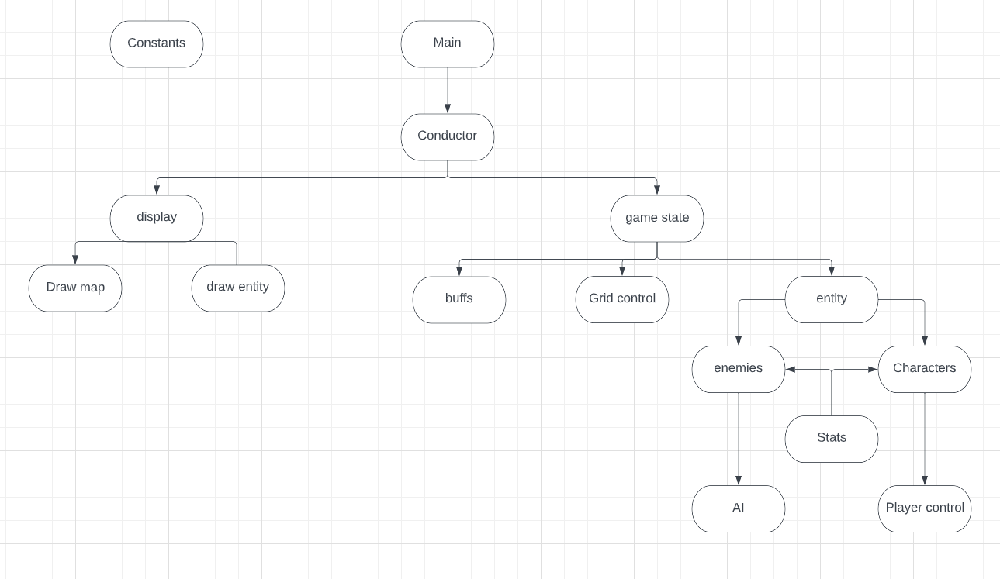

# Overview
## Game Summary

### Game description
> **Title**: [untitled]

> **Summary**: This game is a Rogue-lite, top-down, turn based tactics game. The basic gameplay consists of choosing your party, then fighting a series of enemies until the end is reached or the party fails. In between each level there is a temporary buff rewarded that last only until the end of the run. There are also power-ups that exist in between runs.

### Glossary
 > **Rogue-lite**: A rogue-lite is a genre of game that involves the player going through procedurally generated maps. It is expected that the player will fail many times and will have to start again from the beginning. It is also expected that the player will get better at the game between each run both because of the player's skill and through power-ups that will not be erased upon fail.

 > **Top-Down**: Top-down refers to the point of view of the player. Instead of the view being from behind the character, or through the eyes of the character, the view is a birds-eye view of the whole map.

 > **Map**: The area of play that the characters exist on.

 > **Turn based tactics**: A tactics game is one in which the player controls multiple characters to fight many enemies. They exist on a grid in which they can move and have different ranges at which they can hit enemies. Turn based refers to the fact that only one entity (either character or enemy) can act at any given time. On each of the character's turns the player chooses how they move and what they do. On the enemy's turn, they follow a certain directive programed in.

 > **Player**: The player refers to the user of the program.

 > **Character**: Refers to an entity that exists within the game. Some are controlled by the player.

 > **Buff**: A buff is a beneficial effect that passively makes the player's characters more capable of winning.

 > **Power-ups**: Power-ups are similar to buffs in that they empower the characters. For the purpose of this game, the distinction is that buffs will only last during runs, power-ups are permanent.

 > **Party**: A party refers to the group of characters that the player can control.

 > **Runs**: A run refers to the act of the player beginning to play through the game. This lasts until the player beats the game, or loses.
## Game Structure
### Goal
The goal of the game is to get through three maps. The goal of each map is to defeat all of the enemies on the map without having all your party members die.
### Entities
>Entities are broken up into 2-3 categories:
>* **Characters**: Characters are entities that are controled by the player.
>* **Enemies**: enemies are entities that are hostile to the player's characters.
>* ***(Stretch)*** **Obstacles**: Objects that prevents movement and attacks.

>All entities have inherint traits called stats. The stats are as such:
>* **Health**: The amount of damage that an entity can take. Once this number becomes 0, the entity no longer can take actions. 
>* **Durability**: The amount of damage mitigated every time the entity would receive damage.
>* **Speed**: The number of squares an entity can move on its turn.
>* **Initiative**: How early the entity would move in turn order. The higher the number, the higher the priority.
>* **Power**: The amount of base damage the entity deals when attacking.
>* ***(Stretch)*** **Type**: The type of enemy or character it is. Types determine weaknesses and resistances to each other.

> ***(Stretch)*** Each entity will have an ability unique to it. Abilites are powerful attacks or buffs that entities can perform at a cost.
### Map and generation
Maps are grids of tiles. There will be three unique maps, one for each level of the game. Each tile on the grid can contain one entity. Entities will be allowed to move vertically and horizontally along the grid. 

***(Stretch)***: On each entity's turn, they will have a grid extending out from them showing where they can move.

### Buffs and Power-ups
>#### **Buffs**
>Buffs are positive changes to the characters. In between each map the player will have a choice from one of three buffs to pick. The buff will only last until the end of the run. These buffs can be simple buffs like an increase to stats.
>#### ***(Stretch)*** **Power-Ups**
> Power-ups are just the same as buffs, but they are selected before a run and last between runs.

### Combat
Entities will take turns dealing damage to the enemy party until one party can no longer fight. 

Entitites will have a range which indicates from how far away can they hit other entities. 

***(Stretch)*** Attacks can also have negative effects associated with them, like damage over time or reduce durability.

### Enemy AI
Enemies will follow this basic instruction:

1. Locate the nearest enemy
2. If two entites are tied for closest, pick the one with higher initiative.
3. If the entity is within range, attack the entity
4. If not move as close as it needs to to hit the entity, moving vertically first, then horizontally.
5. If the entity is then in range, attack.

# Code Structure

## Constants
A file that will contain constant values that almost every other file will reference
## Main
A basic main function that will call conductor
## Conductor
A function that will conduct the main operations of the game, from calling display, to maintaining the gamestate
## Display
The main class for handling the display of game elements and the main window of the game itself.
## Draw map
The inherited class that will handle the display and the removal of each map as the player progresses.
## Draw entity
The inherited class that will handle the display, animation, and removal of enitites on the map.
## Game state
The class that moderates things such as progression, win/lose conditions, turn order, and other things that are general functions of the game.
## Buffs
The class that handles the buffs that appear in between levels and how they effect entities.
## Grid Control
The class that handles entities moving and existing on the grid.
## Entities
The general class that contains general traits for all entities.
## Enemies
The inherited class that contains the functions of the enemies. 
## AI
the functionality that controls the decisions of the enemies
## Characters
The inherited class that contains the functions of the party.
## Player control
The functionality that allows the player to interact with the game and control the characters.
## Stats
Basic data that all entities share (probably is just a part of the entity class.)

## Possibly missed aspects
### Menu
Draws the menu which the player interacts with.
### Draw buff
Draws the buffs between maps
